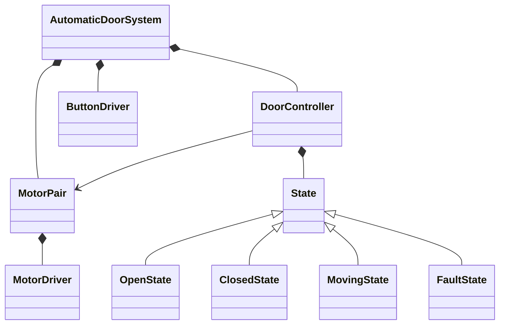
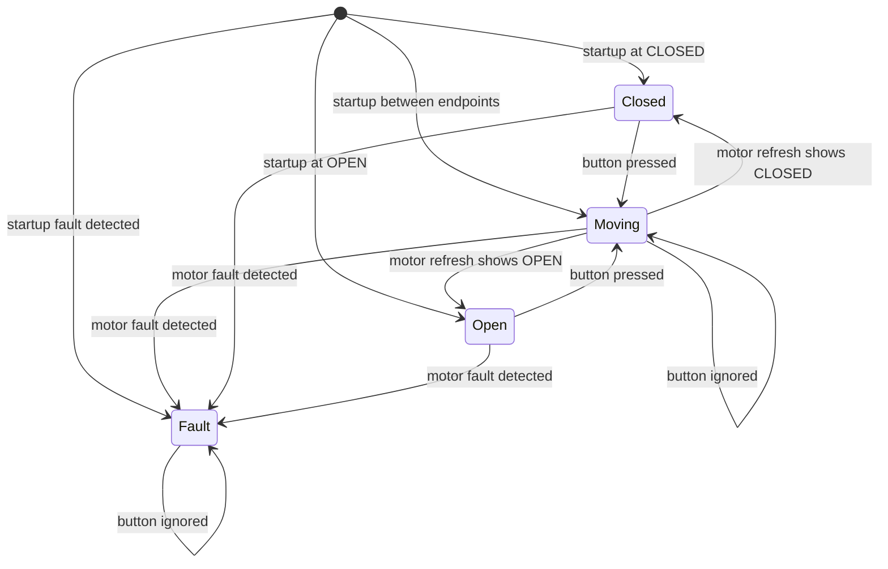
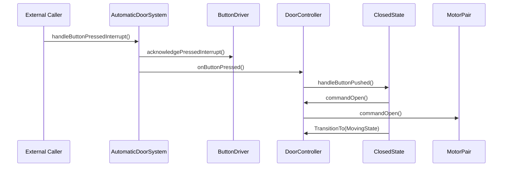
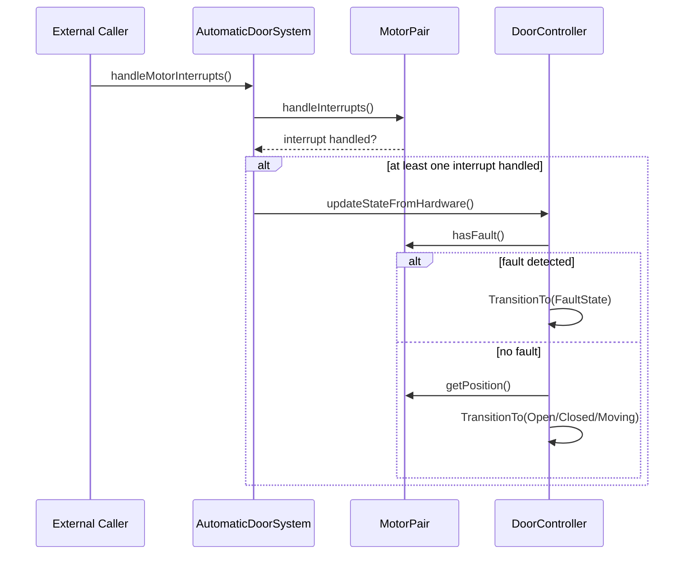

# Architecture Diagrams

These diagrams are intentionally simplified. They show the main control flow and ownership boundaries without repeating every member, enum, or helper method from the code.

## 1. Class Diagram

Notes:
- `AutomaticDoorSystem` is the top-level coordinator. It owns the system flow for button interrupts and motor interrupt refresh.
- `DoorController` owns the active state object and delegates button behavior to the current concrete state.
- `MotorPair` hides the two physical motors behind one actuator-facing interface.
- `MovingState` stores direction of travel internally.

## 2. State Machine Diagram

Notes:
- On startup, an intermediate position causes the controller to command the door open and enter `MovingState`.
- `MovingState` remembers whether the door is opening or closing, but the state machine only shows the higher-level state names.
- A motor fault means either contradictory end states or mismatched motion between the two motors.
- `FaultState` is terminal in the current design. Recovery is intentionally out of scope.

## 3. Sequence Diagrams

### Button Press While Door Is Closed

Notes:
- `AutomaticDoorSystem` performs two separate actions: acknowledge the hardware interrupt, then notify the controller.
- `MotorPair::commandOpen()` sends the command out to both motor drivers.

### Motor Interrupt Refresh Flow

Notes:
- `MotorPair::handleInterrupts()` clears open and closed interrupt bits for both motor drivers.
- The controller only refreshes state after the system sees that at least one motor interrupt was handled.
- The transition to `Open`, `Closed`, `Moving`, or `Fault` is decided inside `DoorController::updateStateFromHardware()`.
