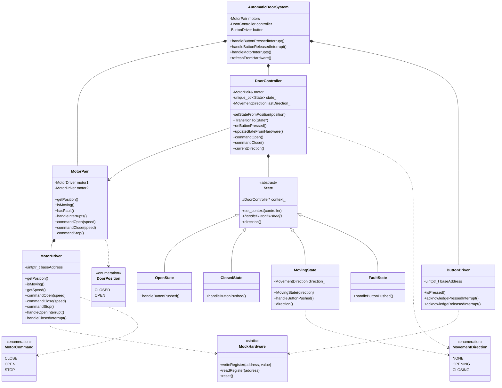
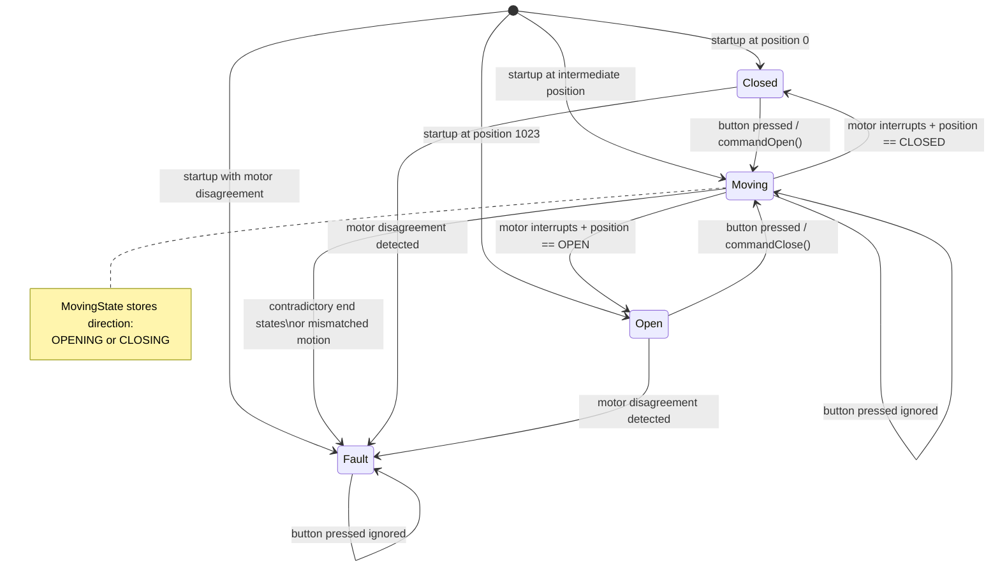
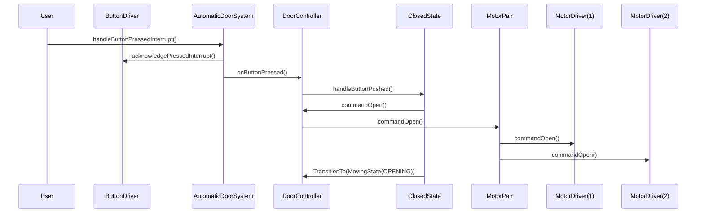
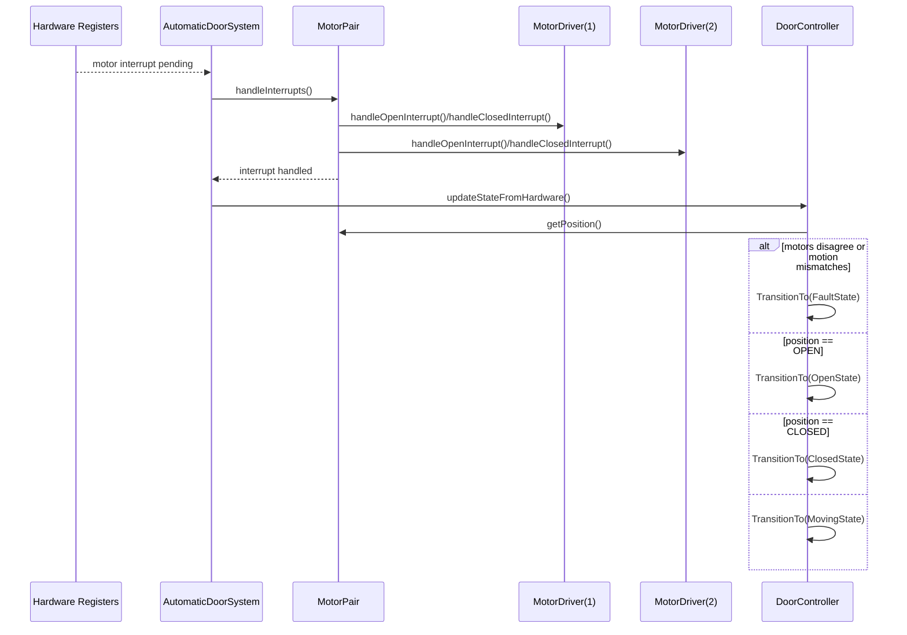

# Architecture Diagrams

This document contains the core architecture diagrams for the Automatic Door Opener interview implementation.

Recommended submission set:

1. Class Diagram
2. State Machine Diagram
3. Sequence Diagram

These three diagrams are enough to show structure, runtime behavior, and the role of the State pattern without overwhelming the reviewer.

## 1. Class Diagram

## 2. State Machine Diagram

## 3. Sequence Diagram

### Button Press While Door Is Closed

### Motor Interrupt Refresh Flow

