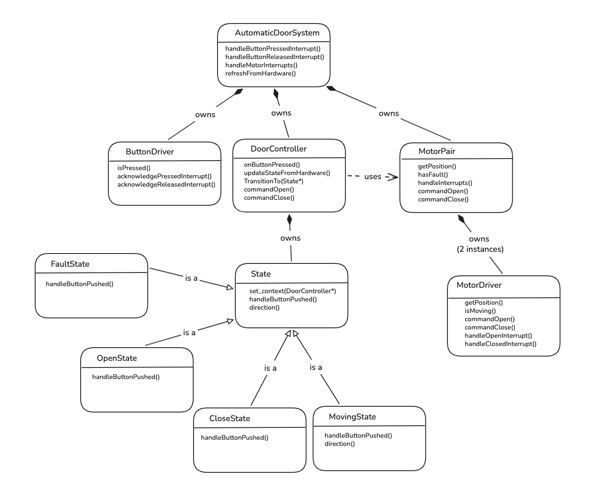
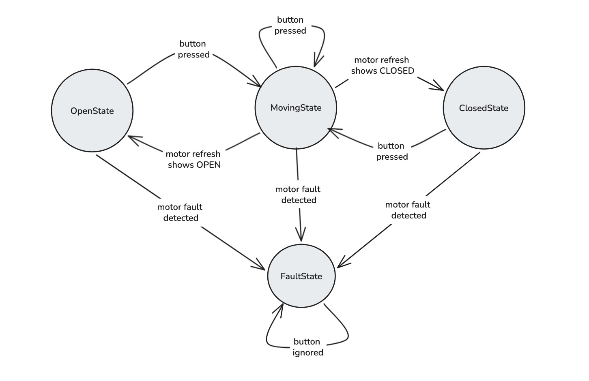
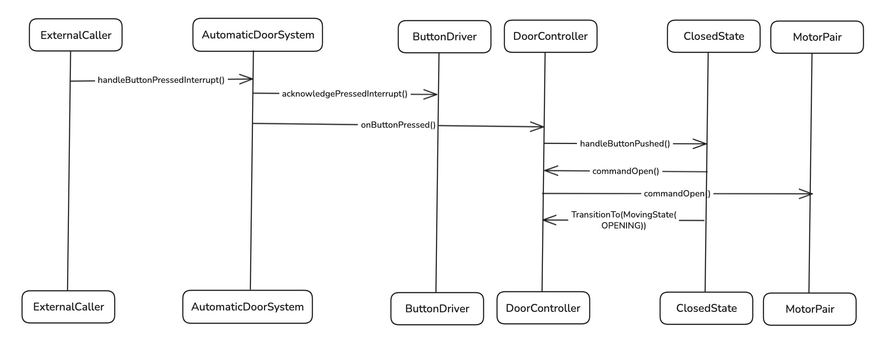

# Architecture Diagrams

The following diagrams are the final architecture views for this submission. They are intentionally focused on the main design decisions and runtime flow rather than every implementation detail.

## 1. Class Diagram

Notes:
- `AutomaticDoorSystem` is the top-level coordinator. It owns the button driver, door controller, and motor pair, and acts as the application boundary between hardware events and door-control behavior.
- `ButtonDriver` is intentionally narrow. Its responsibility is limited to reading button state and acknowledging button interrupts; it does not contain door-control policy.
- `DoorController` owns the active `State` object and delegates button behavior to the current concrete state. This is the context in the State pattern.
- `MotorPair` provides a single actuator-facing interface over the two physical motor drivers. The controller commands the pair rather than managing each motor directly.
- `OpenState`, `ClosedState`, `MovingState`, and `FaultState` are concrete states derived from the abstract `State` base class.
- `MovingState` carries direction internally so the system can preserve whether the door is opening or closing while in motion.
- `FaultState` models a safe terminal condition for motor disagreement or mismatched motion. Recovery behavior is intentionally left out of scope for this implementation.

## 2. State Machine Diagram

Notes:
- A button press in `OpenState` commands the door to close and transitions the controller into `MovingState`.
- A button press in `ClosedState` commands the door to open and transitions the controller into `MovingState`.
- A button press while already moving is intentionally ignored, matching the system requirement that motion should not be interrupted by another button press.
- A motor refresh that reports the open endpoint transitions `MovingState` to `OpenState`.
- A motor refresh that reports the closed endpoint transitions `MovingState` to `ClosedState`.
- A detected motor fault transitions the controller into `FaultState`. In the current implementation, fault conditions include contradictory end states or mismatched motor motion.
- `FaultState` ignores subsequent button presses. This keeps the current design conservative until an explicit recovery requirement is defined.
- At startup, the controller derives its initial state from hardware. If the door is between endpoints and no fault is present, the controller commands an open operation and enters `MovingState`.

## 3. Sequence Diagram

### Button Press While Door Is Closed

Notes:
- The sequence begins when an external runtime layer, interrupt handler, or polling loop calls `AutomaticDoorSystem::handleButtonPressedInterrupt()`.
- `AutomaticDoorSystem` first asks `ButtonDriver` to acknowledge the pressed interrupt, then separately notifies `DoorController` that a button press has occurred.
- `ButtonDriver` does not call into `DoorController`; this separation is intentional. The driver handles button hardware, while the controller handles door behavior.
- `DoorController` delegates the event to the active concrete state. In this sequence, the active state is `ClosedState`.
- `ClosedState` responds by asking the controller to `commandOpen()`, which causes `DoorController` to forward the request to `MotorPair`.
- `MotorPair` then issues the open command to both underlying motor drivers.
- After commanding motion, `ClosedState` transitions the controller to `MovingState(OPENING)`.

## Diagram Scope

These diagrams emphasize ownership boundaries, state transitions, and the main button-driven control flow. Lower-level register reads, interrupt bit clearing, and individual motor driver calls are intentionally summarized unless they are needed to explain a design decision.
